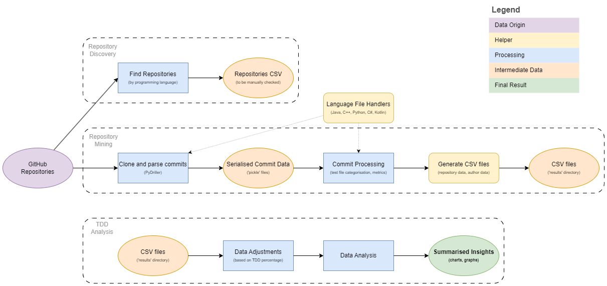

[](https://github.com/Andrei-Constantin-Programmer/TDD_In_Practice/actions/workflows/python-app.yml)
[](https://shields.io/badges/git-hub-repo-size)
[](LICENSE)

This is a project created as part of the Software Development Practice (COMP0104) assignment 2 at University College London (UCL).
Its role is to mine repositories (from the Apache Software Project) to see how much TDD is used in practice.

## Table of Contents
- [Installing](#installing)
- [Run Analysis](#run-analysis)
  - [Parameters](#analysis-parameters)
  - [Help](#analysis-help)
- [Run Repo Finder](#run-repo-finder)
    - [Parameters](#repo-finder-parameters)
    - [Help](#finder-help)
- [Run Tests](#run-tests)
- [Workflow Diagram](#workflow-diagram)

## Installing

1. Ensure **Python 3.10.x** or higher is installed

2. Clone project
Clone the repository locally, or download and extract the ZIP file.

3. Install prerequisite packages
Run the following command from the project root:
    ```bash
    pip install -r requirements.txt
    ```

## Run Analysis
To execute the TDD analysis, use the command-line interface:
```bash
python tdd_analysis.py  [--date DATE] [--language LANGUAGE] [--languages LANGUAGES ...]
                        [--repository REPOSITORY] [--batch_size BATCH_SIZE] [--force-mine]
                        [--verbose]
```

### Analysis Parameters

- `--date DATE (optional)`: The date for the experiment in YYYY-MM-DD format. Defaults to a specific date in `tdd_analysis.py`.
  
- `--language LANGUAGE (optional)`: Single programming language to analyse. Defaults to `Java`.
  
    **Note:** If this argument is provided, the `'--languages'` argument will be ignored
  
- `--languages LANGUAGES ... (optional)`: List of programming languages to analyse. Defaults to `['Java', 'Python', 'Kotlin', 'C#', 'Rust']`.
  
    **Note**: If the `'--language'` argument is provided, this list is ignored.
  
- `--repository --repo REPOSITORY (optional)`: URL for repository to analyse. By default, analyse all repos under `resources/repositories`.
  
    **Note**: The `'--language'` argument must also be provided if `'--repository'` is provided.

- `--batch_size BATCH_SIZE (optional)`: Batch size for asynchronous repository retrieval using PyDriller. Defaults to 8.

- `--force_mine (optional)`: Forcefully mine the repository/repositories, even if they have already been retrieved. Defaults to False.
  
- `--verbose (optional)`: Enable verbose output for debugging or detailed logs.  


### Analysis Help
To display a help message with detailed usage instructions, run:

```bash
python tdd_analysis.py --help
``` 

## Run Repo Finder
To execute the repo finder, use the command-line interface:
```bash
python find_repos.py  [--github_token TOKEN] [--organisation ORGANISATION] [--language LANGUAGE] [--pagination PAGINATION] [--maximum MAXIMUM]
```

### Repo Finder Parameters
- `--github_token GITHUB_TOKEN`: Personal GitHub token. For information on how to create one, visit: https://docs.github.com/en/authentication/keeping-your-account-and-data-secure/managing-your-personal-access-tokens#creating-a-fine-grained-personal-access-token
  
- `--language LANGUAGE`: Programming language to find repositories for.

- `--organisation --org ORGANISATION (optional)`: Organisation to find repositories for. (default: Apache)
      
- `--pagination PAGINATION (optional)`: Pagination for searching GitHub. Defaults to 100.

- `--maximum --max MAXIMUM (optional)`: Maximum number of repositories to find.

### Finder Help
To display a help message with detailed usage instructions, run:

```bash
python find_repos.py --help
``` 

## Run Tests
To run the unit tests, simply call:
```bash
pytest
```

# Workflow Diagram

This diagram illustrates the entire workflow.


